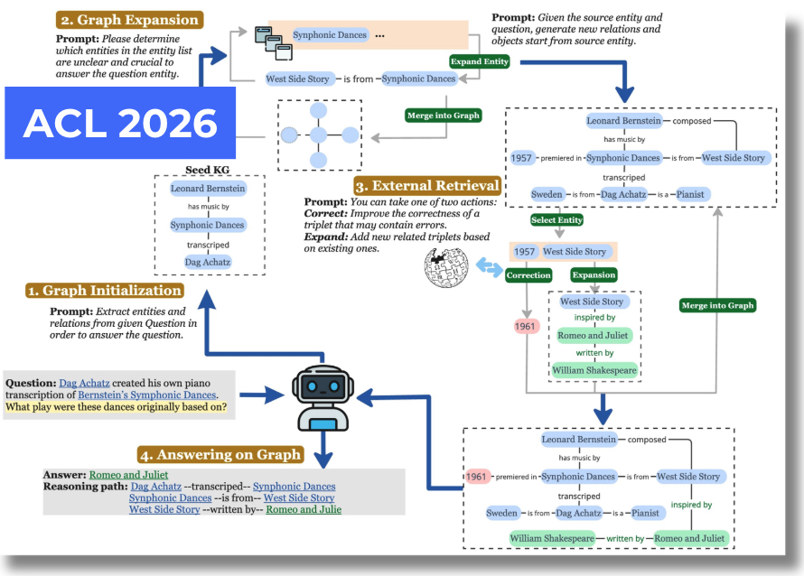

I'm Shanglin (Jason) Wu, a first-year Ph.D. student in Computer Science and Informatics at Emory University, where I am advised by Dr. [Kai Shu](https://www.cs.emory.edu/~kshu5/). I received my Bachelor’s degree in Artificial Intelligence from [Yuanpei College, Peking University](https://yuanpei.pku.edu.cn/en/aboutyuanpei/collegeprofile/index.htm) in 2025.

My research interests center on trustworthy AI, with a particular focus on the interpretability of large language models (LLMs). Specifically, I am interested in exploring the mechanisms of reasoning and knowledge grounding in LLMs, aiming to develop methods that enhance both their factual consistency and explainability. By improving the trustworthiness of LLMs, I hope to contribute to their safe and effective application across a wide range of domains.

News
======
- 2025.07: 🎉🎉 Completed my internship in Microsft Research Asia Alumni!

Research Experience
======
- **Microsoft Research Asia Alumni**,  Beijing, China, March 2025 - July 2025
  - [Data, Knowledge, and Intelligence group](https://www.microsoft.com/en-us/research/group/data-knowledge-intelligence/)
  - Research Intern

Publications
======
<table style="width: 100%; border: none; border-collapse: collapse;">
  <tr>
    <td style="width: 30%; vertical-align: center; border: none; padding: 0;">
      
    </td>
    <td style="width: 70%; vertical-align: middle; text-align: left; font-size: 1.2em; border: none;">
      <a href="https://arxiv.org/abs/2509.03540">Improving Factuality in LLMs via Inference-Time Knowledge Graph Construction</a> 
      <strong>Shanglin Wu</strong>, Lihui Liu, Jinho D. Choi, Kai Shu 
    </td>
  </tr>
</table>

Education
======
- 2025 - Now: Ph.D., Computer Science and Informatics. Emory University.
- 2021 2025: B.s., Artificial Intelligence. Peking University

