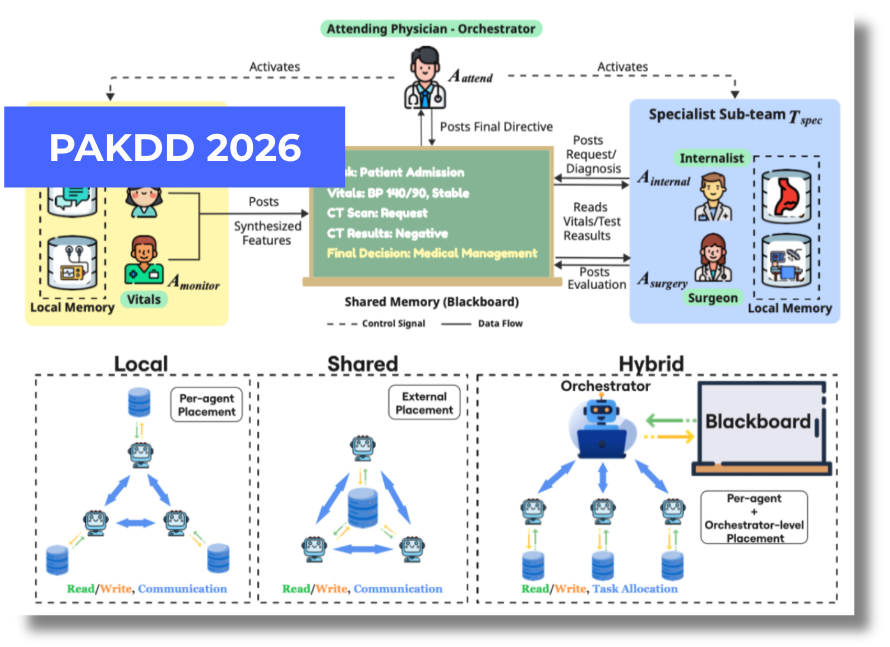

I'm Shanglin (Jason) Wu, a first-year Ph.D. student in Computer Science and Informatics at Emory University, where I am advised by Dr. [Kai Shu](https://www.cs.emory.edu/~kshu5/). I received my Bachelor’s degree in Artificial Intelligence from [Yuanpei College, Peking University](https://yuanpei.pku.edu.cn/en/aboutyuanpei/collegeprofile/index.htm) in 2025.

My research interests center on building the next generation of autonomous AI agents. Specifically, my work addresses two fundamental challenges in the field: How do we make agents more trustworthy, and how do we make multiple agents work together effectively? I am driven by the potential of agents systems to solve complex, real-world problems across domains.

News
======
- 2025.07: 🎉🎉 Completed my internship in Microsft Research Asia Alumni!

Research Experience
======
- **Microsoft Research Asia Alumni**,  Beijing, China, March 2025 - July 2025
  - [Data, Knowledge, and Intelligence group](https://www.microsoft.com/en-us/research/group/data-knowledge-intelligence/)
  - Research Intern

Publications
======
<table style="width: 100%; border: none; border-collapse: collapse;">
  <tr>
    <td style="width: 30%; vertical-align: center; border: none; padding: 0;">
      
    </td>
    <td style="width: 70%; vertical-align: middle; text-align: left; font-size: 1.2em; border: none;">
      <a href="https://arxiv.org/abs/2509.03540">Improving Factuality in LLMs via Inference-Time Knowledge Graph Construction</a> 
      <strong>Shanglin Wu</strong>, Lihui Liu, Jinho D. Choi, Kai Shu 
    </td>
  </tr>
</table>

<table style="width: 100%; border: none; border-collapse: collapse;">
  <tr>
    <td style="width: 30%; vertical-align: center; border: none; padding: 0;">
      
    </td>
    <td style="width: 70%; vertical-align: middle; text-align: left; font-size: 1.2em; border: none;">
      <a href="https://www.researchgate.net/publication/398392208_Memory_in_LLM-based_Multi-agent_Systems_Mechanisms_Challenges_and_Collective_Intelligence">Memory in LLM-based Multi-agent Systems: Mechanisms, Challenges, and Collective Intelligence</a> 
      <strong>Shanglin Wu</strong>, Kai Shu 
    </td>
  </tr>
</table>

Education
======
- 2025 - Now: Ph.D., Computer Science and Informatics. Emory University.
- 2021 2025: B.s., Artificial Intelligence. Peking University

Academic Service
======
Reviewer/Program Committee: ICLR{2026}, TACL{2026}, WWW{2026}, ACL ARR{2025}, IEEE CogMI{2025}, IEEE BigData{2026}.

